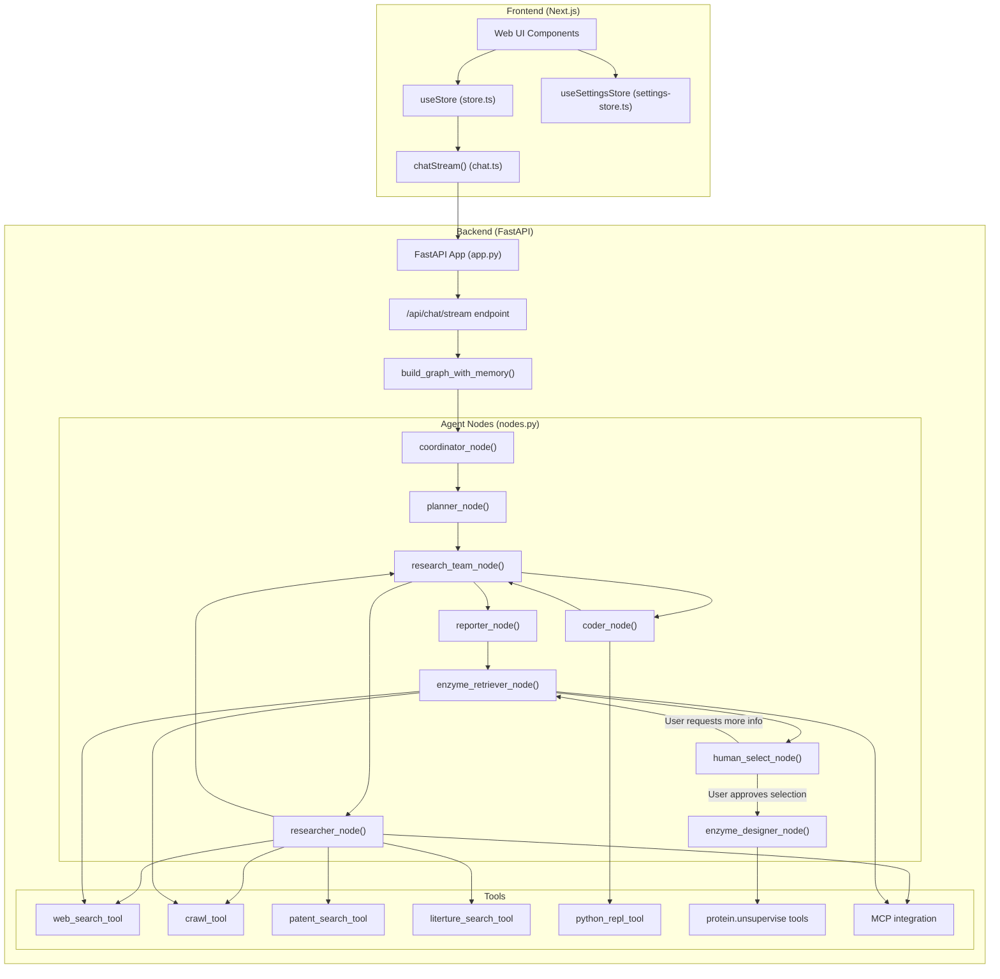

### High-Level Architecture

The high-level architecture consists of two main components:

1. **Frontend**: A Next.js web application that provides the user interface and manages client-side state.
   - Uses Zustand stores (`useStore` and `useSettingsStore`) for state management
   - Communicates with the backend through the `chatStream()` function

2. **Backend**: A FastAPI server that processes requests and orchestrates the research workflow.
   - Implements the LangGraph workflow for agent coordination
   - Provides REST API endpoints for chat, text-to-speech, and content generation
   - Integrates tools for web search, crawling, and code execution

Sources: [web/src/core/store/store.ts](), [web/src/core/api/chat.ts](), [src/server/app.py](), [src/graph/nodes.py]()