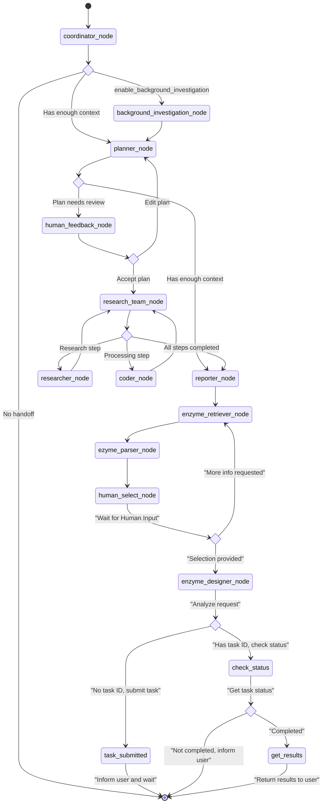

### LangGraph State Flow

The LangGraph workflow manages state transitions between agent nodes. Each node processes the current state and returns a `Command` object that updates the state and directs the workflow to the next node:

Sources:
- src/graph/nodes.py

The state object in LangGraph contains:

| State Key                          | Description                                     |
| ---------------------------------- | ----------------------------------------------- |
| `messages`                         | History of conversation messages                |
| `plan_iterations`                  | Number of plan refinement cycles                |
| `current_plan`                     | The current research plan being executed        |
| `observations`                     | Results collected from research steps           |
| `final_report`                     | The generated report at the end of the workflow |
| `locale`                           | Detected language locale for the conversation   |
| `auto_accepted_plan`               | Whether to automatically accept plans           |
| `enable_background_investigation`  | Whether to perform background searches          |
| `background_investigation_results` | Results from background investigations          |
| `enzyme_retriever_content`         | Results from enzyme retriever node              |
| `enzyme_retriever_sequences`       | Enzyme infos parsed by enzyme parser node       |
| `enzyme_selection_feedback`        | User's natural language selection for design    |
| `design_task_id`                   | The ID of the submitted protein design task     |
| `enzyme_mutant_results`            | Mutant results from enzyme_designer_node        |

Sources:
- src/graph/nodes.py
- src/graph/types.py