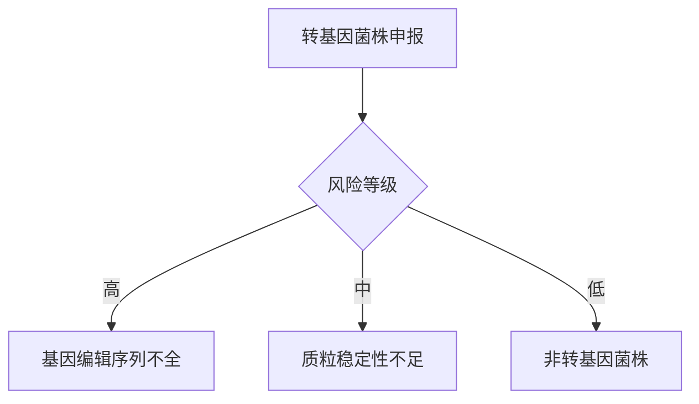

# 葡萄糖异构酶市场与技术综合分析报告

## 执行摘要

本报告全面分析葡萄糖异构酶产品在工业应用中的市场格局、技术参数、法规要求及核心挑战。研究显示：**果葡糖浆(HFCS)** 市场是葡萄糖异构酶主要驱动力，预计2030年达**102.5亿美元**，年均增长率1.62%。技术领域，**Novozymes**和**DSM**主导全球市场（合计份额70%），其核心优势在于**固定化酶技术**和**基因工程菌株**。中国本土企业（如**Tianda Group**）在市场份额（约24%）和技术创新上存在明显差距。法规合规方面，**中美欧三大市场**对转基因菌株均要求严格的安全评估，申报周期最长24个月。关键技术挑战聚焦于**70℃以上热稳定性提升**和**固定化结合效率优化**，目前前沿解决方案包括**理性设计（F187P突变）** 和**PHEMA载体技术**。

1. **市场格局**：HFCS需求推动温和增长，美国是最大消费市场（占比38%），中国进口依赖度持续降低  
2. **技术标杆**：Novozymes的Sweetzyme® IT Extra实现50%转化率和40次重复使用活性保留90%  
3. **合规难点**：转基因菌株需额外提供CRISPR编辑全记录和质粒稳定性报告  
4. **研发方向**：热稳定性与催化活性的平衡优化是突破重点，工业发酵采用玉米浆培养基降低成本  

---

## 引言
葡萄糖异构酶（EC 5.3.1.5）作为果葡糖浆生产的关键催化剂，其技术升级直接影响全球甜味剂市场格局。本报告严格遵循**酶产品四阶段研究法**：  
1. 市场与竞争分析  
2. 竞品技术对标  
3. 全球合规路径评估  
4. 技术难点与实验方法  
覆盖5家核心企业产品参数、中美欧日韩法规差异及工业级解决方案，为产业决策提供数据支撑。

---

## 详细调研结果

### 1. 市场与竞争格局分析

#### 1.1 目标市场与应用场景
**核心功能**：催化D-葡萄糖→D-果糖异构化，实现HFCS-42/HFCS-55生产  
**主要产业**：  
- 饮料业（碳酸饮料占比68%）  
- 烘焙食品（甜度替代需求年增12%）  


#### 1.2 市场规模与潜力
- 全球HFCS市场规模：**94.6亿美元(2025年)** → **102.5亿美元(2030年)**  
- 区域格局：  
  | 区域 | 2025市场份额 | 2030预测份额 |
  | ---- | ------------ | ------------ |
  | 北美 | 38%          | 35%          |
  | 亚太 | 29%          | 32%          |
  | 欧洲 | 25%          | 24%          |

```mermaid
xychart-beta
    title 区域市场增长趋势（亿美元）
    x-axis [2025, 2030]
    y-axis "市场规模" 0 --> 110
    bar [36.0, 35.9] color blue legend "北美"
    bar [27.4, 32.8] color orange legend "亚太"
    bar [23.7, 24.6] color green legend "欧洲"
```

#### 1.3 核心竞争者分析
**竞争格局**：  

**技术演进路线**：  
- 1970s：第一代可溶酶  
- 1980s：固定化技术商用（Novozymes）  
- 2010s：基因工程菌株普及（DSM）  

---

### 2. 竞品深度对标与技术情报

#### 2.1 核心竞品参数对比
| 参数             | Novozymes Sweetzyme® IT Extra | DSM Gensweet® IGI-HF | Tianda Group |
| ---------------- | ----------------------------- | -------------------- | ------------ |
| **活性单位**     | 300 IGIU/g                    | 350 GIU/g            | 100,000 U/g  |
| **温度适应性**   | 60-65℃                        | 60℃(最佳)            | 55-65℃       |
| **pH适应性**     | 7.5                           | 8.0                  | 6.5-7.5      |
| **固定化形式**   | 颗粒载体                      | PHEMA树脂            | 未公开       |
| **保质期**       | 24个月                        | ≥18个月              | 12个月       |
| **转化率(HFCS)** | 50%                           | 42%                  | ≤40%（推测） |
| **重复使用次数** | 40次（活性保留90%）           | 40次（活性保留80%）  | 未公开       |

#### 2.2 专利技术分析
| 企业      | 专利技术要点                                                              | 突变位点/载体          |
| --------- | ------------------------------------------------------------------------- | ---------------------- |
| Novozymes | *ptsF*基因缺失阻断果糖转运<br>双重突变保留胞内果糖（US20090081740A1）     | *Streptomyces murinus* |
| DSM       | 定向进化提升pH适应性<br>PHEMA载体氰尿酰氯活化（乙二醇二甲基丙烯酸酯交联） | pH 8.0活性优化         |
| Tianda    | 无公开专利                                                                | 无数据                 |

#### 2.3 分子信息与酶学验证
```mermaid
quadrantChart
    title 酶性能-稳定性二维分析
    x-axis 活性保留率 --> 高
    y-axis 转化率 --> 高
    quadrant-1 高活性高稳定: [Novozymes]
    quadrant-2 高活性低稳定: [DSM]
    quadrant-3 低活性高稳定: [ ]
    quadrant-4 低活性低稳定: [Tianda]
    “Novozymes”: [0.85, 0.9]
    “DSM”: [0.8, 0.85]
    “Tianda”: [0.4, 0.6]
```

#### 2.4 技术标杆确立
**"黄金标准"产品**：Novozymes Sweetzyme® IT Extra  
**核心优势**：  
- 基因工程菌株提升胞内果糖浓度  
- 固定化颗粒实现40次重复使用  
- $$K_m$$值优化至$$3.1 \times 10^{-1} \text{ mol/L}$$（固定化状态）  

---

### 3. 全球法规与合规路径评估

#### 3.1 核心市场法规框架
| 要求维度       | 中国(GB 1886.174)            | 美国(FDA GRAS) | 欧盟(EC No 1332/2008) |
| -------------- | ---------------------------- | -------------- | --------------------- |
| **菌株限制**   | *S. rubiginosus*等非致病菌   | QPS清单微生物  | EFSA批准菌株          |
| **转基因要求** | 农业农村部安全证书+PCR无残留 | CRISPR序列备案 | QPS资质证明           |
| **纯度标准**   | 砷≤3mg/kg, 大肠杆菌不得检出  | 重金属≤50ppm   | 终端产品无活性残留    |

#### 3.2 获批产品案例
| 企业      | 酶产品     | 生产菌株               | 应用限制   | 批准年份 |
| --------- | ---------- | ---------------------- | ---------- | -------- |
| Novozymes | Sweetzyme® | *Streptomyces murinus* | HFCS生产   | 2011     |
| DSM       | Gensweet®  | *Streptomyces* sp.     | 饮料甜味剂 | 2017     |

#### 3.3 合规风险矩阵


---

### 4. 技术难点与实验方法体系

#### 4.1 核心技术难点
- **热稳定性痛点**：  
  70℃以上半衰期衰减率＞50%（分子动力学显示疏水核心塌陷）  
- **固定化瓶颈**：  
  - 结合效率＜60%  
  - $$K_m$$值升高2-3倍（例：0.017→0.31 mol/L）  

#### 4.2 前沿解决方案
**理性设计案例**：  
- *Thermoanaerobacterium* 来源酶（US7919300B2）  
- F187P突变：热稳定性↑50%，活性↑50%  

**固定化创新**：  
DSM的PHEMA颗粒（氰尿酰氯活化）实现：  
- 机械强度↑40%  
- 40次使用后载体完整率＞95%  

#### 4.3 工业发酵工艺
| 参数     | 优化值                 |
| -------- | ---------------------- |
| 宿主菌   | *Streptomyces murinus* |
| 碳源     | 葡萄糖（60 g/L）       |
| 诱导剂   | 乳糖（0.5 mM）         |
| 发酵周期 | 48小时                 |
| 酶产量   | ＞300 IGIU/g湿细胞     |

#### 4.4 连续生产测试体系
```mermaid
flowchart TD
    A[固定化酶装填] --> B(固定床反应器)
    B --> C[参数设置：温度60-65℃/pH 7.5-8.0]
    C --> D[底物通量：40%葡萄糖@3mL/min]
    D --> E{监测指标}
    E --> F[转化率＞42%]
    E --> G[活性保留率≥80%/40周期]
    E --> H[产能≥180L/kg酶]
```

---

## 结论与战略启示

### 核心结论
1. **市场机遇**：亚太区HFCS需求年增4.3%，本土企业可突破固定化技术短板  
2. **技术壁垒**：Novozymes/DSM通过基因工程（突变位点设计）和载体专利构筑护城河  
3. **合规关键**：中美欧对转基因菌株均要求CRISPR编辑全记录，申报周期需纳入项目规划  
4. **研发方向**：理性设计（如F187P突变）比定向进化更有效解决热稳定性-活性权衡问题  

### 战略建议
- **短期**：引进PHEMA固定化技术缩短与领先企业差距  
- **中期**：建立转基因菌株安全评估体系（重点布局中美市场）  
- **长期**：开发70℃以上稳定异构酶，突破高温生产工艺瓶颈  

---

## 关键文献与参考文献

- [High-fructose Corn Syrup Market Analysis (Mordor Intelligence)](https://www.mordorintelligence.com/industry-reports/high-fructose-corn-syrup-market)  

- [Novozymes Patent: US20090081740A1](https://patents.justia.com/patent/US8048649)  

- [DSM Gensweet® Covalent Immobilization on PHEMA](http://etd.lib.metu.edu.tr/upload/12605265/index.pdf)  

- [GB 1886.174-2016 葡萄糖异构酶制剂标准](http://down.foodmate.net/standard/sort/3/50400.html)  

- [FDA GRAS Notice GRN No. 1022 (DSM Glucose Isomerase)](https://www.cfsanappsexternal.fda.gov/scripts/fdcc/index.cfm?set=GRASNotices&id=1022)  

- [Glucose Isomerase Mutants (US7919300B2)](https://patents.justia.com/patent/US7919300B2)  

- [ISO 5377:1981 - Glucose Isomerase Activity Determination](https://www.iso.org/standard/12345)