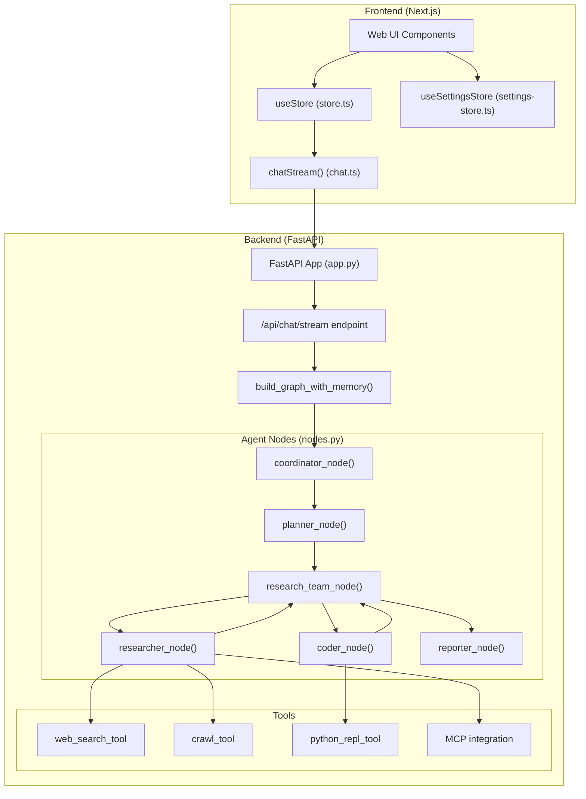

```mermaid
graph TB
    subgraph "Frontend (Next.js)"
        direction TB
        WebUI["Web UI Components"]
        Store["useStore (store.ts)"]
        SettingsStore["useSettingsStore (settings-store.ts)"]
        ChatAPI["chatStream() (chat.ts)"]
    end
    
    subgraph "Backend (FastAPI)"
        direction TB
        Server["FastAPI App (app.py)"]
        ChatEndpoint["/api/chat/stream endpoint"]
        GraphBuilder["build_graph_with_memory()"]
        
        subgraph "Agent Nodes (nodes.py)"
            CoordinatorNode["coordinator_node()"]
            PlannerNode["planner_node()"]
            ResearchTeamNode["research_team_node()"]
            ResearcherNode["researcher_node()"]
            CoderNode["coder_node()"]
            ReporterNode["reporter_node()"]
        end
        
        subgraph "Tools"
            WebSearchTool["web_search_tool"]
            CrawlTool["crawl_tool"]
            PythonREPLTool["python_repl_tool"]
            MCPTools["MCP integration"]
        end
    end
    
    WebUI --> Store
    WebUI --> SettingsStore
    Store --> ChatAPI
    ChatAPI --> Server
    Server --> ChatEndpoint
    ChatEndpoint --> GraphBuilder
    GraphBuilder --> CoordinatorNode
    CoordinatorNode --> PlannerNode
    PlannerNode --> ResearchTeamNode
    ResearchTeamNode --> ResearcherNode
    ResearchTeamNode --> CoderNode
    ResearcherNode --> ResearchTeamNode
    CoderNode --> ResearchTeamNode
    ResearchTeamNode --> ReporterNode
    
    ResearcherNode --> WebSearchTool
    ResearcherNode --> CrawlTool
    ResearcherNode --> MCPTools
    CoderNode --> PythonREPLTool
```