# DeerFlow 项目计划

## 项目描述

DeerFlow 是一个多智能体系统，旨在通过结构化工作流协调专门的 AI 智能体来自动化复杂的研究任务。它将语言模型与网页搜索、爬取和 Python 代码执行等专用工具相结合，以生成关于广泛主题的综合研究报告。特别地，在生物技术领域，系统集成了酶序列检索（`EnzymeRetrieverNode`）和酶分子设计（`EnzymeDesignerNode`）等高级功能，能够帮助用户发现并创造新的酶变体，使其成为蛋白质工程研究的强大助手。

该系统采用流线型工作流，各专业组件协同工作，处理用户查询、进行研究并生成详细报告。DeerFlow 基于 LangGraph 构建，用于工作流编排，并包含一个复杂的 Web UI 用于可视化和交互。

## 项目架构

```mermaid
graph TB
    subgraph "Frontend (Next.js)"
        direction TB
        WebUI["Web UI Components"]
        Store["useStore (store.ts)"]
        SettingsStore["useSettingsStore (settings-store.ts)"]
        ChatAPI["chatStream() (chat.ts)"]
    end
    
    subgraph "Backend (FastAPI)"
        direction TB
        Server["FastAPI App (app.py)"]
        ChatEndpoint["/api/chat/stream endpoint"]
        GraphBuilder["build_graph_with_memory()"]
        
        subgraph "Agent Nodes (nodes.py)"
            CoordinatorNode["coordinator_node()"]
            BackgroundInvestigatorNode["background_investigator_node()"]
            PlannerNode["planner_node()"]
            HumanFeedbackNode["human_feedback_node()"]
            ResearchTeamNode["research_team_node()"]
            ResearcherNode["researcher_node()"]
            CoderNode["coder_node()"]
            ReporterNode["reporter_node()"]
            EnzymeRetrieverNode["enzyme_retriever_node()"]
            EnzymeParserNode["enzeme_parser_node()"]
            HumanSelectNode["human_select_node()"]
            EnzymeDesignerNode["enzyme_designer_node()"]
        end
        
        subgraph "Tools"
            WebSearchTool["web_search_tool"]
            CrawlTool["crawl_tool"]
            PythonREPLTool["python_repl_tool"]
            PatentSearchTool["patent_search_tool"]
            LiteratureSearchTool["literature_search_tool"]
            MCPTools["MCP integration"]
        end
    end
    
    %% Frontend Connections
    WebUI --> Store
    WebUI --> SettingsStore
    Store --> ChatAPI
    ChatAPI --> Server

    %% Backend High-level Connections
    Server --> ChatEndpoint
    ChatEndpoint --> GraphBuilder
    
    %% Agent Workflow Connections
    GraphBuilder --> CoordinatorNode
    CoordinatorNode -- "enable_background_investigation" --> BackgroundInvestigatorNode
    CoordinatorNode -- "No background" --> PlannerNode
    BackgroundInvestigatorNode --> PlannerNode
    
    PlannerNode -- "Plan needs review" --> HumanFeedbackNode
    PlannerNode -- "Has enough context" --> ReporterNode
    
    HumanFeedbackNode -- "Edit plan" --> PlannerNode
    HumanFeedbackNode -- "Accept plan" --> ResearchTeamNode
    
    ResearchTeamNode -- "Research step" --> ResearcherNode
    ResearchTeamNode -- "Processing step" --> CoderNode
    ResearcherNode --> ResearchTeamNode
    CoderNode --> ResearchTeamNode
    ResearchTeamNode -- "All steps completed" --> ReporterNode
    
    ReporterNode --> EnzymeRetrieverNode
    EnzymeRetrieverNode --> EnzymeParserNode
    EnzymeParserNode --> HumanSelectNode
    
    HumanSelectNode -- "Selection provided" --> EnzymeDesignerNode
    HumanSelectNode -- "More info requested" --> EnzymeRetrieverNode
    
    %% Tool Connections
    ResearcherNode --> WebSearchTool
    ResearcherNode --> CrawlTool
    ResearcherNode --> PatentSearchTool
    ResearcherNode --> LiteratureSearchTool
    ResearcherNode --> MCPTools
    CoderNode --> PythonREPLTool
```

