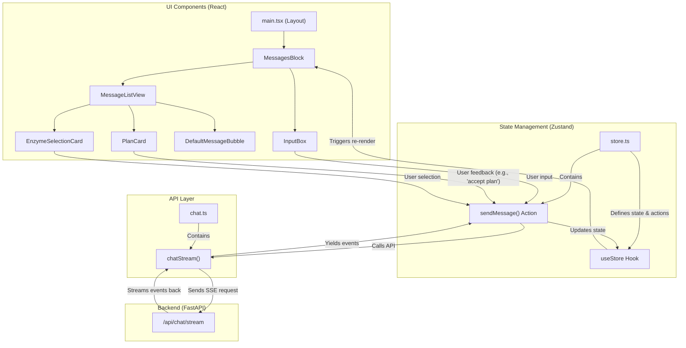

# DeerFlow 前端架构

本文档旨在阐述 DeerFlow 前端应用的架构设计，分析其与项目计划的对齐情况，并提出未来的优化方向。

## 1. 核心技术栈

- **框架**: [Next.js](https://nextjs.org/) (App Router)
- **语言**: [TypeScript](https://www.typescriptlang.org/)
- **UI**: [React](https://reactjs.org/), [Tailwind CSS](https://tailwindcss.com/), [shadcn/ui](https://ui.shadcn.com/)
- **状态管理**: [Zustand](https://github.com/pmndrs/zustand)
- **动画**: [Framer Motion](https://www.framer.com/motion/)

## 2. 整体架构

前端架构遵循组件化和响应式状态管理的思想。核心围绕着一个全局的 Zustand `store`，负责处理用户交互、与后端 API 通信以及管理整个应用的会话状态。



### 2.1. 数据流与人机交互

本应用最核心的特性之一是其处理 **人机交互（Human-in-the-Loop）** 的能力。这允许后端工作流暂停，向前端请求人类的决策或输入，然后根据用户的反馈继续执行。

这个流程的实现非常精巧：

1.  **中断事件 (Interrupt Event)**: 当后端 LangGraph 工作流执行到需要人类输入的节点时（如 `HumanFeedbackNode` 或 `HumanSelectNode`），它会通过 SSE (Server-Sent Events) 连接发送一个 `event: interrupt` 事件。该事件的 `data` 负载中包含了需要用户决策的所有信息（例如，待审核的计划、待选择的酶序列等）。

2.  **API 层 (`chat.ts`)**: `chatStream` 函数接收到这个 `interrupt` 事件后，并不做任何特殊处理，而是像处理其他事件（如 `message_chunk`）一样，将其透明地传递给上层调用者。

3.  **状态管理层 (`store.ts`)**: `sendMessage` 动作函数在它的主循环中接收到 `interrupt` 事件。它不会创建一个单独的 `interrupt` 状态，而是将中断信息作为一个属性，附加到当前正在处理的 assistant 消息对象上。这是一个关键设计，它将中断与特定的对话上下文绑定在了一起。

4.  **UI 响应 (`message-list-view.tsx`)**:
    *   UI 组件通过 `useLastInterruptMessage` 这个 Zustand hook 来实时订阅"最后一个包含中断信息的消息"。
    *   `MessageListItem` 组件会检查当前渲染的消息是否就是这个"中断消息"。
    *   如果是，它不会渲染默认的消息气泡，而是根据中断的类型（例如，通过 `message.agent` 或中断负载中的特定字段来判断）渲染一个专用的 **交互式卡片**，如 `PlanCard` 或 `EnzymeSelectionCard`。

5.  **反馈闭环**:
    *   这些交互式卡片（如 `PlanCard`）包含按钮（"接受"、"编辑计划"）或表单。
    *   当用户点击按钮时，会触发一个回调函数（如 `onSendMessage`），这个函数最终会再次调用 `store.ts` 中的 `sendMessage`。
    *   在这次新的调用中，用户的选择（例如 `"accepted"`）会作为 `interrupt_feedback` 参数被发送到后端。
    *   后端工作流接收到这个反馈后，从暂停处继续执行。

这个设计形成了一个完整的、由数据驱动的异步反馈闭环，具有很强的可扩展性。

## 3. 与项目计划的符合度分析

将当前的前端实现与 `project_plan.md` 和 `dataflow.md` 中的要求进行比较后，我们得出以下结论：

**当前实现与项目计划高度吻合。**

前端已经成功地实现了 `project_plan.md` 中描述的核心人机交互功能。具体来说：

-   ✅ **计划审核 (`HumanFeedbackNode`)**: 已通过 `PlanCard` 组件实现。用户可以查看由 `planner_node` 生成的计划，并选择接受或要求修改。
-   ✅ **人类选择 (`HumanSelectNode`)**: 已通过 `EnzymeSelectionCard` 组件实现。当 `enzyme_retriever_node` 找到多个酶序列后，前端可以清晰地展示这些选项，并让用户进行选择，以驱动后续的 `enzyme_designer_node`。
-   ✅ **架构一致性**: `useStore`, `chatStream` 等核心模块的命名和功能均与计划中的图表保持一致。

总而言之，前端团队不仅理解了项目需求，还设计并实现了一个健壮、可扩展的解决方案来满足这些人机交互的需求。项目文档中的设想已成为现实。

## 4. 未来优化计划 (Modification Plan)

尽管当前实现非常出色，但我们仍可以在以下几个方面进行优化，以提高代码质量、可维护性和用户体验。

### 4.1. 改进中断处理的类型安全

**现状**:
当前代码通过 `(interruptMessage as any)?.type === "enzyme_selection"` 这样的方式来判断中断类型，这依赖于any转换，不是类型安全的。

**优化建议**:
1.  在 `src/core/messages/types.ts` (或类似文件) 中为不同的中断负载定义明确的 TypeScript 接口。
    ```typescript
    // In types.ts
    interface BaseInterrupt {
      type: string;
    }
    
    export interface PlanInterrupt extends BaseInterrupt {
      type: 'plan_review';
      plan: string[];
      options: Option[];
    }
    
    export interface EnzymeSelectionInterrupt extends BaseInterrupt {
      type: 'enzyme_selection';
      sequences: ProteinSequence[];
      options: Option[];
    }
    
    export type InterruptPayload = PlanInterrupt | EnzymeSelectionInterrupt;
    
    // In Message type
    interface Message {
      // ...
      interrupt?: InterruptPayload;
    }
    ```
2.  在 `message-list-view.tsx` 中使用类型守卫 (type guards) 来进行安全的条件渲染，从而移除 `any` 类型转换，并获得更好的自动补全支持。

### 4.2. 为酶设计结果创建专用展示组件

**现状**:
`EnzymeDesignerNode` 执行完成后，其结果（如诱变后的蛋白质序列）可能会作为一条普通消息在默认的 `MessageBubble` 中以 Markdown 格式显示。这对于复杂的结构化数据来说，体验不佳。

**优化建议**:
1.  创建一个新的 React 组件 `EnzymeDesignerResultCard.tsx`。
2.  此组件专门用于友好地展示酶设计的结果，例如：
    *   清晰地展示原始序列和突变后序列的对比 (Sequence Alignment View)。
    *   高亮显示被改变的氨基酸。
    *   如果可能，可以集成一个简单的 3D 分子查看器（如 [Mol*](https://molstar.org/)）来展示预测的蛋白质结构。
3.  在 `MessageListItem` 中增加新的渲染逻辑，当 `message.agent === 'enzyme_designer'` 时，渲染这个新组件。

### 4.3. 增加代码内注释

**现状**:
人机交互的流程虽然设计精妙，但在代码中缺少注释，新成员理解起来可能有一定难度。

**优化建议**:
在以下关键位置补充清晰的英文注释：
-   `store.ts` 的 `sendMessage` 循环：解释为何 `interrupt` 事件被附加到消息上而不是存为独立状态。
-   `message-list-view.tsx` 的 `MessageListItem`: 解释条件渲染逻辑如何根据消息的中断数据来选择不同的卡片组件。
-   `PlanCard.tsx` / `EnzymeSelectionCard.tsx`: 解释 `onSendMessage` 回调如何将用户的反馈传回上层。

这项工作将极大地降低未来维护的复杂度。

通过实施以上优化计划，我们可以使 DeerFlow 的前端代码库更加健壮、可扩展，并为用户提供世界一流的交互体验。 