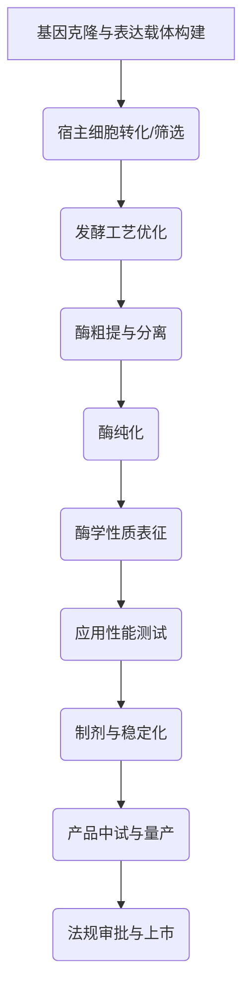
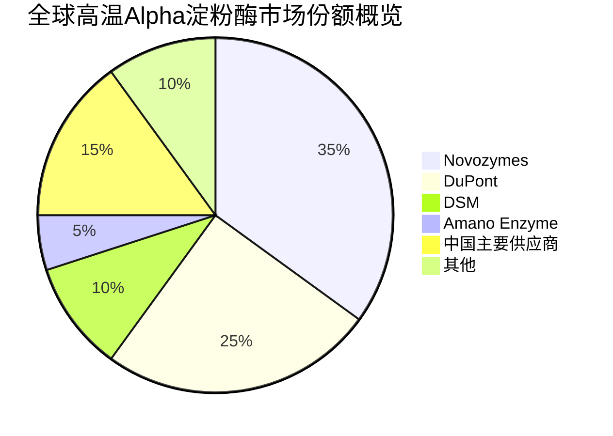

下图展示了高温Alpha淀粉酶从基因到产品的通用开发流程：

```mermaid
flowchart TD
    A[基因克隆与表达载体构建] --> B(宿主细胞转化/筛选)
    B --> C(发酵工艺优化)
    C --> D(酶粗提与分离)
    D --> E(酶纯化)
    E --> F(酶学性质表征)
    F --> G(应用性能测试)
    G --> H(制剂与稳定化)
    H --> I(产品中试与量产)
    I --> J(法规审批与上市)
```

下图展示了全球高温Alpha淀粉酶市场的主要参与者份额概览：

```mermaid
pie title 全球高温Alpha淀粉酶市场份额概览
    "Novozymes" : 35
    "DuPont" : 25
    "DSM" : 10
    "Amano Enzyme" : 5
    "中国主要供应商" : 15
    "其他" : 10
```
*(注：上述市场份额为示意性数据，实际数据应基于详尽的市场研究，原始资料中未提供具体市场份额百分比。)*