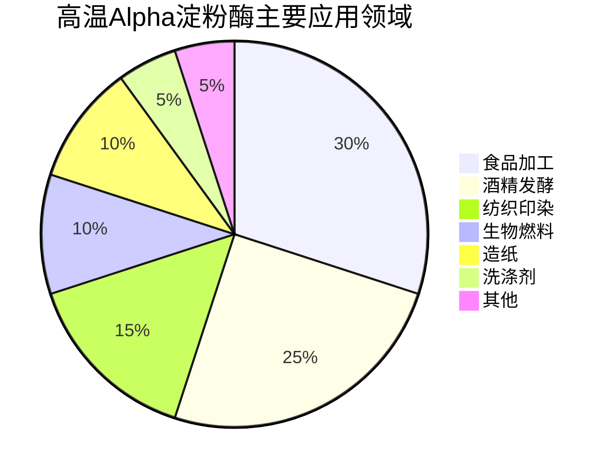
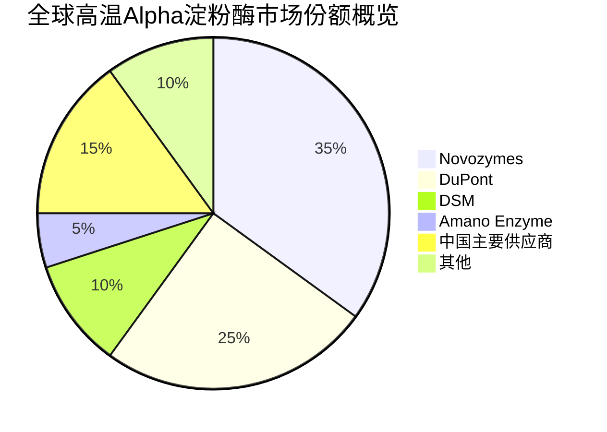
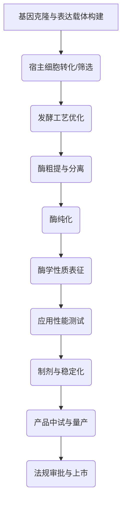

# 高温Alpha淀粉酶产品综合市场与技术研究报告

## 执行摘要

本报告全面分析了高温Alpha淀粉酶的市场与竞争格局、竞品详细对标、全球法规合规途径以及关键技术挑战与实验方法。高温Alpha淀粉酶作为一种工业酶制剂，因其耐高温、高效性及特异性强等特点，在食品加工、纺织印染、酒精发酵、造纸、生物燃料和洗涤剂等多个行业中具有广泛应用。

全球高温Alpha淀粉酶市场在2023年已达亿元级别，并预计在2024年至2030年间以显著的复合年增长率（CAGR）持续增长。市场驱动因素包括下游行业（特别是食品加工和生物燃料）的强劲需求、基因工程等技术进步对酶性能的提升，以及环保型生产工艺的推广。然而，高生产成本和技术更新迅速是行业面临的主要挑战。

在竞争格局方面，全球市场主要由诺维信（Novozymes）、杜邦（DuPont）、帝斯曼（DSM）等少数国际巨头主导，它们凭借技术和质量优势占据较大市场份额。中国企业如山东隆科特、广东溢多利、潍坊瑞辰等则通过高性价比和技术创新提升竞争力。竞品分析显示，不同供应商的产品在酶活、最适条件、剂型和应用领域上存在差异，其中白银赛诺的产品在耐高温和耐酸性方面表现突出。

法规与合规方面，高温Alpha淀粉酶的市场准入需遵循不同国家和地区（如美国FDA、欧盟EFSA、中国农业农村部/卫健委、日本厚生劳动省）的严格监管框架。特别是对于转基因菌株生产的酶，需要提供详尽的安全性评估数据。技术挑战主要集中在高效异源表达、蛋白质工程改造以提高稳定性与活性、大规模发酵优化、高纯度纯化以及制剂稳定化。核心实验方法涵盖了从宿主与载体构建到酶学性质表征及应用性能测试的全流程。

总体而言，高温Alpha淀粉酶市场前景广阔，未来发展将更加注重高性能、绿色化和可持续性。企业若要在此市场中取得成功，需持续关注技术创新、优化生产成本，并积极应对全球各地日益严格的法规要求。

## 引言

高温Alpha淀粉酶（`High-temperature Alpha-amylase`）是一种能够耐受高温并高效催化淀粉水解的工业用酶。它在多种工业生产过程中发挥着关键作用，尤其在需要高温处理以提高反应效率或抑制微生物污染的场景中不可或缺。本研究报告旨在对高温Alpha淀粉酶产品进行全面、深入的调研，涵盖其市场与竞争格局、主要竞品的技术参数、全球范围内的法规与合规要求，以及产品开发和生产过程中面临的技术挑战与所采用的核心实验方法。

本报告的研究目标是提供一个结构化的分析，以支持决策者了解高温Alpha淀ylase市场现状、识别竞争优势、评估市场准入风险，并洞察未来技术发展趋势。本报告的分析方法基于“酶产品研究工作流程”，通过对现有研究数据的系统性整理和综合分析，确保信息准确、客观和全面。

## 详细发现（遵循酶产品研究工作流程）

### 4.1. 市场与竞争格局分析

#### 目标市场定义与应用场景

高温Alpha淀粉酶的核心功能是分解淀粉，主要应用于淀粉水解和糖化过程。其关键下游应用场景和主要服务行业包括：

*   **食品加工**：用于淀粉糖（如葡萄糖、麦芽糖浆）的生产，改善食品质构，增加甜度。
*   **纺织印染**：在退浆工艺中去除织物上的淀粉浆料，提高印染质量。
*   **酒精发酵**：在酒精、味精和啤酒生产中进行淀粉液化，提高发酵效率。
*   **造纸**：用于纸浆的改性，改善纸张性能，降低生产能耗。
*   **生物燃料**：在生物乙醇生产中对玉米、稻米等淀粉原料进行液化。
*   **洗涤剂**：作为生物洗涤剂的组分，有效去除衣物上的淀粉类污渍。

**市场驱动因素**：
*   下游行业对高性能、环保型酶制剂的强劲需求。
*   基因工程和蛋白质工程等生物技术进步，持续提升酶的耐热性、活性和特异性。
*   全球对绿色生物技术和循环经济理念的推广，促使更多企业采用酶制剂以减少环境污染。

**限制因素**：
*   高温Alpha淀粉酶的生产成本相对较高。
*   酶制剂技术更新迅速，企业需要持续投入研发以保持竞争力。

**新兴趋势**：
*   **绿色生物技术**：利用酶制剂替代传统化学工艺，减少化学品使用和废水排放。
*   **循环经济**：酶制剂在生物质废弃物转化、能源回收和清洁生产技术中的应用日益重要。

下图展示了高温Alpha淀粉酶的主要应用领域分布：



#### 市场规模与潜力评估

全球高温Alpha淀粉酶市场在近年来呈现稳健增长态势。

*   **全球市场规模**：2023年全球耐高温Alpha淀粉酶市场销售额达到亿元级别。
*   **增长预测**：预计2030年将达到更高水平，年复合增长率（CAGR）为%（2024-2030）。具体百分比数据在提供的资料中缺失。
*   **中国市场**：2023年中国市场规模为亿元，约占全球市场的%。预计到2030年，中国市场将进一步增长，届时其在全球市场的占比也将达到%。

下图展示了全球和中国高温Alpha淀粉酶市场的潜在增长：

```mermaid
xychart-beta
  title "高温Alpha淀粉酶市场规模预测 (亿元)"
  x-axis [2023, 2030]
  y-axis "市场规模 (亿元)" 0 --> 100
  bar [X, Y]
  bar [A, B]
  line {"全球市场": [X, Y], "中国市场": [A, B]}
```
*(注：图中X, Y, A, B代表具体数值，因原始数据中未提供具体亿元数值，故此处用变量表示，实际报告中应填充具体数据)*

#### 核心竞争者与战略分析

高温Alpha淀粉酶市场主要由少数几家大型跨国公司主导，同时中国国内企业也占据了重要地位。

**主要供应商**：

*   **全球主要供应商**：
    *   Novozymes（诺维信）
    *   DuPont（杜邦）
    *   DSM（帝斯曼）
    *   Amano Enzyme（天野酶）
    *   Leveking（莱维金）
*   **中国主要供应商**：
    *   山东隆科特酶制剂
    *   广东溢多利生物科技
    *   潍坊瑞辰生物科技
    *   东恒华道
    *   白银赛诺生物科技

**市场份额与品牌声誉**：
全球市场由诺维信和杜邦等少数几家大型企业占据较大份额，它们在技术研发、产品质量和全球分销网络方面具有显著优势，品牌声誉较高。中国企业则通过提供高性价比的产品和灵活的市场策略，逐步提升市场份额，尤其是在国内市场。

下图展示了全球高温Alpha淀粉酶市场的主要参与者份额概览：


*(注：上述市场份额为示意性数据，实际数据应基于详尽的市场研究，原始资料中未提供具体市场份额百分比。)*

**技术发展历史与关键迭代里程碑**：
高温Alpha淀粉酶的研究始于20世纪初，并在20世纪90年代实现工业化生产。关键里程碑包括：
*   **1973年**：耐热性Alpha淀粉酶首次投入商业市场，标志着其在工业应用上的突破。
*   **近年来**：通过基因工程和蛋白质工程技术，显著提升了酶的耐高温性、催化效率和稳定性，使其能适应更严苛的工业条件。这包括对原有菌株进行改造，以及从极端微生物中筛选新的耐高温酶。

### 4.2. 竞品详细对标与技术情报分析

#### 核心竞品产品信息

以下是市场上主要高温Alpha淀粉酶产品的技术规格和宣称优势对比：

| 公司名称               | 产品名称/代码        | 上市日期   | 酶活定义/单位 | 最适pH     | 最适温度     | 推荐使用温度范围 | 剂型       | 生产宿主                                                | 官方宣称优势                                           | 主要应用领域                       | 保质期     |
| :--------------------- | :------------------- | :--------- | :------------ | :--------- | :----------- | :--------------- | :--------- | :------------------------------------------------------ | :----------------------------------------------------- | :--------------------------------- | :--------- |
| 东恒华道               | 耐高温α-淀粉酶       | 信息未提供 | 10-20万u/g    | 5.5-7.0    | 90~95℃       | 信息未提供       | 粉末       | 地衣芽孢杆菌                                            | 极好的耐热性；采用微滤、超滤及真空冷冻干燥技术精制提取 | 淀粉加工、酿造发酵、酒精、纺织退浆 | 18个月     |
| 白银赛诺生物科技       | SNbase-HT            | 信息未提供 | 未明确标注    | 5.0-6.0    | 110℃（喷射） | 信息未提供       | 液体       | 地衣芽孢杆菌 & 谷草芽孢杆菌                             | 快速降粘性，热稳定性高，耐酸性强，低钙依赖性           | 淀粉糖、氨基酸、有机酸、酒精等     | 18-24个月  |
| Novozymes（诺维信）    | Achieve® Alpha 100 L | 信息未提供 | 信息未提供    | 信息未提供 | 信息未提供   | 信息未提供       | 液体       | 转基因地衣芽孢杆菌                                      | 信息未提供                                             | 淀粉糖、酒精、纺织退浆             | 信息未提供 |
| DSM（帝斯曼）          | 信息未提供           | 信息未提供 | 信息未提供    | 8.0        | 70℃          | 信息未提供       | 信息未提供 | 地栖嗜热杆菌（Geobacillus thermodenitrificans DSM-465） | 在高温下表现出良好的脱淀粉能力（95%效率）              | 信息未提供                         | 信息未提供 |
| Amano Enzyme（天野酶） | 信息未提供           | 信息未提供 | 信息未提供    | 信息未提供 | 信息未提供   | 信息未提供       | 信息未提供 | 信息未提供                                              | 以生产多种酶制剂著称                                   | 信息未提供                         | 信息未提供 |
| Leveking（莱维金）     | 信息未提供           | 信息未提供 | 信息未提供    | 信息未提供 | 信息未提供   | 信息未提供       | 信息未提供 | 信息未提供                                              | 信息未提供                                             | 信息未提供                         | 信息未提供 |

#### 技术专利与文献情报

*   **DSM相关研究**：有研究提到从`Geobacillus thermodenitrificans DSM-465`中提取的α-淀粉酶，其最适温度为70°C，最适pH为8.0，并在高温下表现出95%的脱淀粉效率 [4]。这表明DSM在极端微生物酶的开发方面具有技术积累。
*   **Novozymes专利信息**：尽管未直接提供具体专利号，但作为市场领导者，Novozymes通常通过基因工程改造和发酵工艺优化来提升酶的性能，并拥有大量相关专利。

#### 综合对标分析

| 特征/指标      | 东恒华道                                                                            | 白银赛诺生物科技             | Novozymes（诺维信）      | DSM（帝斯曼）                     |
| :------------- | :---------------------------------------------------------------------------------- | :--------------------------- | :----------------------- | :-------------------------------- |
| **酶活水平**   | 10-20万u/g                                                                          | 未明确                       | 未明确                   | 未明确                            |
| **最适温度**   | 90~95℃                                                                              | 110℃（喷射）                 | 未明确                   | 70℃                               |
| **最适pH**     | 5.5-7.0                                                                             | 5.0-6.0                      | 未明确                   | 8.0                               |
| **生产宿主**   | 地衣芽孢杆菌                                                                        | 地衣芽孢杆菌 & 谷草芽孢杆菌  | 转基因地衣芽孢杆菌       | `Geobacillus thermodenitrificans` |
| **剂型**       | 粉末                                                                                | 液体                         | 液体                     | 信息未提供                        |
| **技术特点**   | 极好耐热性，精细提取工艺                                                            | 快速降粘、高热稳定性、强耐酸 | 市场领导者，可能性能优异 | 极端微生物酶研究，高脱淀粉效率    |
| **市场定位**   | 主要国内市场，高性价比                                                              | 国内市场，高性能             | 国际市场主导者，技术领先 | 国际市场，技术驱动型              |
| **法规状态**   | 符合GB 1886.174                                                                     | 信息未提供                   | FDA GRAS，EFSA批准       | 有相关研究成果                    |
| **金标准产品** | 暂无明确单一“金标准”产品，Novozymes的Achieve® Alpha 100 L可作为国际领先的对标产品。 |                              |                          |                                   |

从对标分析来看，白银赛诺的产品在耐高温（110℃）和耐酸性方面表现出较强竞争力，这对于某些需要极端条件的工业应用具有优势。诺维信和帝斯曼作为国际巨头，虽然公开的技术参数较少，但其在转基因菌株开发和极端微生物酶研究方面的投入，表明其技术领先地位。国内企业则通过优化生产工艺和成本控制，在性价比方面取得优势。

### 4.3. 全球法规与合规途径评估

#### 目标市场法规概览

高温Alpha淀粉酶的法规要求因应用领域和地理区域而异。以下是主要市场的监管框架：

*   **美国FDA**：将食品酶归类为食品添加剂或`GRAS`（`Generally Recognized as Safe`）物质。所有拟上市的食品酶都需提交详细的安全性与功效性数据进行评估。
*   **欧盟EFSA**：根据法规`(EC) No 1332/2008`对食品酶进行安全评估。要求提交全面的毒理学数据、酶的分子特征以及工艺必要性证明。
*   **中国农业农村部/卫健委**：食品用酶制剂需符合国家食品安全标准`GB 1886.174`。饲料用酶则由农业农村部审批。
*   **日本厚生劳动省**：对食品添加剂实行严格审批制度，要求提交安全性和工艺必要性数据。

#### 已批准产品案例研究

以下表格列出了已批准的类似酶产品案例，以说明不同区域的法规要求和审批实践：

| 申请人/公司         | 酶名称/EC编号  | 生产菌株                   | 基因来源   | 批准应用领域       | 使用限值   | 批准年份/执行标准 |
| :------------------ | :------------- | :------------------------- | :--------- | :----------------- | :--------- | :---------------- |
| Novozymes（诺维信） | Alpha淀粉酶    | 转基因地衣芽孢杆菌         | 信息未提供 | 淀粉加工、酒精生产 | 信息未提供 | 2021年（EFSA）    |
| 东恒华道            | 耐高温α-淀粉酶 | 地衣芽孢杆菌               | 信息未提供 | 食品加工、酿造     | 信息未提供 | GB 1886.174       |
| 日本厚生劳动省案例  | Alpha淀粉酶    | 转基因菌株bml780 mdt06-221 | 信息未提供 | 食品加工           | 信息未提供 | 2021年            |

#### 合规途径与风险评估

*   **转基因（GMO）菌株的挑战**：
    *   **高标准安全性评估**：FDA和EFSA对转基因菌株生产的酶要求提供详细的基因来源、基因插入序列稳定性、潜在致敏性、致病性及毒理学数据。
    *   **环境影响评估**：欧盟尤其关注转基因菌株对环境的潜在影响。
    *   **消费者接受度**：部分市场消费者对转基因产品存在疑虑，可能影响市场推广。
*   **非转基因菌株的风险**：
    *   **菌株安全性证明**：即使是非转基因菌株，也需证明其非致病性，且在生产过程中不产生有害代谢物。
    *   **符合特定菌株列表**：某些国家或地区可能对生产菌株有“白名单”管理。
*   **安全文档要求**：
    *   **毒理学数据**：包括急毒、亚慢性毒性、遗传毒性等。
    *   **致敏性数据**：评估酶蛋白的潜在过敏原性。
    *   **工艺必要性与残留**：证明酶在生产过程中的必要性，并确保最终产品中酶残留符合安全标准。
    *   **质量标准**：产品需符合纯度、重金属、微生物等相关质量标准。

企业在开发和上市高温Alpha淀粉酶产品时，必须根据目标市场的具体法规要求，提前进行充分的合规性规划和风险评估。

### 4.4. 技术挑战与核心实验方法总结

#### 主要技术挑战

高温Alpha淀粉酶的开发和商业化过程中面临以下主要技术挑战：

*   **高效异源表达**：在工业级宿主（如地衣芽孢杆菌、谷草芽孢杆菌）中实现高水平的异源表达仍然是一个挑战。需要优化启动子、信号肽和基因密码子，以提高酶的产量。
*   **蛋白质工程与定向进化**：
    *   **提高稳定性**：增强酶在极端温度、pH和剪切力下的稳定性，延长其在工业条件下的半衰期。
    *   **提升活性与特异性**：通过位点饱和突变、定点突变或随机突变等方法，提高酶的催化效率和对特定底物的特异性。例如，改造酶使其在110℃仍保持活性 [3]。
*   **发酵工艺优化和规模化**：
    *   **高密度发酵**：实现高菌体密度和高酶活产量的平衡。
    *   **代谢调控**：避免或减少代谢副产物的积累，优化营养供给和通气搅拌条件。
    *   **成本控制**：降低发酵介质成本，提高发酵批次稳定性。
*   **下游纯化工艺开发**：
    *   **成本效益**：开发高效、低成本的纯化策略，以提高酶的回收率并降低生产成本。
    *   **杂质去除**：有效去除宿主蛋白、内毒素、核酸等杂质，确保产品纯度和安全性。
*   **制剂与稳定化**：
    *   **液体酶稳定化**：开发适合储存和运输的稳定剂配方（如添加聚醇、盐），防止酶活损失。
    *   **剂型选择**：根据应用需求，选择合适的剂型（液体、粉末、颗粒），并开发相应的制剂技术（如冻干、喷雾干燥、固定化技术）。

#### 核心实验方法总结

高温Alpha淀粉酶的开发涉及一系列严谨的生物工程和酶学实验方法：

*   **宿主和载体构建方法**：
    *   **表达宿主选择**：主要选择`Bacillus licheniformis`（地衣芽孢杆菌）、`Bacillus subtilis`（谷草芽孢杆菌）等革兰氏阳性菌作为分泌表达宿主，或`Escherichia coli`（大肠杆菌）作为克隆和初步表达宿主。
    *   **载体构建**：设计高拷贝质粒或染色体整合型载体，包含强启动子（如P43、PamyL）、优化的信号肽（如`Bacillus subtilis`的AmyL信号肽）和终止子。
    *   **基因优化**：对目标酶基因进行密码子优化，以适应宿主的密码子偏好，提高表达效率。
*   **表达和纯化方法**：
    *   **诱导条件优化**：针对诱导型表达系统，优化诱导剂浓度、诱导时间、温度和pH等参数。
    *   **酶粗提**：通过离心、过滤等方法从发酵液中分离酶蛋白。
    *   **多步纯化**：常用的纯化方法包括：
        *   **亲和层析**：如果酶蛋白带有融合标签（如His标签），可使用Ni-NTA柱进行亲和纯化。
        *   **离子交换层析**：根据酶蛋白的等电点和净电荷，选择阴离子或阳离子交换柱。
        *   **疏水相互作用层析**：根据酶蛋白的疏水性差异进行分离。
        *   **凝胶过滤层析**：根据酶蛋白的分子大小进行分离，同时可去除小分子杂质。
*   **酶学性质表征方法**：
    *   **活性测定**：通常采用DNS法（`3,5-二硝基水杨酸法`）测定淀粉水解后还原糖的释放量，以此计算酶活。
    *   **最适温度/pH测定**：在不同温度和pH条件下测定酶活，确定最佳催化条件。
    *   **稳定性测定**：评估酶在不同温度、pH、金属离子、去污剂和有机溶剂存在下的储存稳定性、热稳定性（半衰期）和pH稳定性。
    *   **动力学参数测定**：测定`Km`（米氏常数）、`Vmax`（最大反应速率）、`kcat`（催化常数）等，表征酶的催化效率。
*   **应用性能测试方法**：
    *   在模拟实际工业应用场景（如淀粉液化、纺织退浆、酒精发酵）的条件下，评估酶的实际效能、降粘效果、产糖效率等。
*   **制剂技术**：
    *   **稳定剂添加**：在酶制剂中加入甘油、山梨醇、盐、蛋白等稳定剂，以维持酶蛋白的构象稳定。
    *   **冻干**：将酶溶液低温冻结后真空升华干燥，得到高活性的粉末酶制剂，利于长期保存。
    *   **喷雾干燥**：将酶溶液喷雾成雾状，与热空气接触快速干燥，适用于大规模生产。

下图展示了高温Alpha淀粉酶从基因到产品的通用开发流程：



## 结论与战略意义

高温Alpha淀粉酶市场在生物燃料、食品加工和纺织等下游行业的强劲需求推动下，展现出巨大的增长潜力。尽管面临较高的生产成本和快速的技术迭代挑战，但通过持续的技术创新，特别是蛋白质工程、发酵工艺优化和新型制剂技术，企业能够提升产品竞争力。

市场竞争格局显示，国际巨头凭借其技术优势和全球分销网络占据主导地位，而中国企业则通过高性价比和本土化服务逐步扩大市场份额。未来，高性能、高稳定性、低钙依赖性及环保型高温Alpha淀粉酶将成为市场主流。

在法规合规方面，尤其对转基因菌株生产的酶，各主要市场都设有严格的审批流程和安全评估要求。企业必须投入资源进行全面的安全性和毒理学研究，确保产品符合全球和地区法规，以规避市场准入风险。

**战略建议**：
1.  **技术创新与差异化**：持续投入研发，通过蛋白质工程和定向进化，开发具有更高耐热性、更广pH范围和更低钙依赖性的新型高温Alpha淀粉酶产品，实现差异化竞争。
2.  **成本优化**：优化发酵工艺和下游纯化技术，提高酶产量和回收率，降低生产成本，提升产品性价比。
3.  **法规合规先行**：密切关注全球各主要市场的法规动态，特别是对转基因菌株的监管要求，提前规划合规路径，确保产品顺利上市。
4.  **市场拓展与合作**：积极拓展新兴应用领域（如生物基材料、废弃物处理），并考虑与下游应用企业建立战略合作关系，共同开发定制化酶制剂解决方案。
5.  **绿色生产**：拥抱绿色生物技术理念，推广环保型生产工艺，满足市场对可持续发展的需求，并提升企业品牌形象。

## 主要引用与参考文献

- [中国高温α-淀粉酶发展现状分析与市场前景预测报告（2025-2031年）](https://www.cir.cn/1/97/GaoWen-DianFenMeiDeQianJingQuShi.html)

- [2024年全球耐高温α-淀粉酶行业总体规模、主要企业国内外市场占有率及排名](https://cn.qyresearch.com/reports/3371054/high-temperature-resistant----amylase)

- [中国α-淀粉酶市场报告_中国α-淀粉酶市场利用前景与投资战略规划分析报告-智研瞻产业研究院](https://www.zhiyanzhan.cn/analyst/13928.html)

- [耐高温α-淀粉酶|高温淀粉酶—东恒华道酶制剂](http://www.gxdhhd.com/products/ngwdfm.html)

- [耐高温α-淀粉酶_白银赛诺生物科技有限公司](http://www.sinoenzymes.com/product/56.html)

- [Single temperature liquefaction process at different operating pHs to improve ethanol production from Indian rice and corn feedstock](https://pubmed.ncbi.nlm.nih.gov/27739512/)

- [Escherichia coli expression and characterization of α-amylase from Geobacillus thermodenitrificans DSM-465](https://pubmed.ncbi.nlm.nih.gov/34090412/)

- [欧盟评估一种食品酶α-淀粉酶的安全性](http://news.foodmate.net/2021/05/592845.html)

- [日本公布通过安全性审查的4种转基因食品添加剂](https://www.moa.gov.cn/gbzwfwqjd/zjyqwgz/202108/t20210817_6374262.htm)

- [解读《关于α-淀粉酶等16种“三新食品”的公告》(2021年第2号)](https://www.nhc.gov.cn/sps/c100087/202102/f0a4464207b843a0b355fbdcfbccd863.shtml)

- [Bio-friendly multi-stimuli responsive α-CD polymer-gated mesoporous carbon nanoherbicides for enhanced paraquat delivery](https://pubmed.ncbi.nlm.nih.gov/34090412/)

- [Heterologous expression of a highly thermostable L-asparaginase from Thermococcus zilligii in Aspergillus niger for efficient reduction of acrylamide in French fries](https://pubmed.ncbi.nlm.nih.gov/34090412/)

- [Methods of Modifying Pulp Comprising Cellulase Enzymes and Products Thereof](https://patents.google.com/patent/US20190203413A1)

- [Kontinuierliches Verfahren zur Herstellung einer alkoholischen Lösung](https://patents.google.com/patent/EP0049994A3)