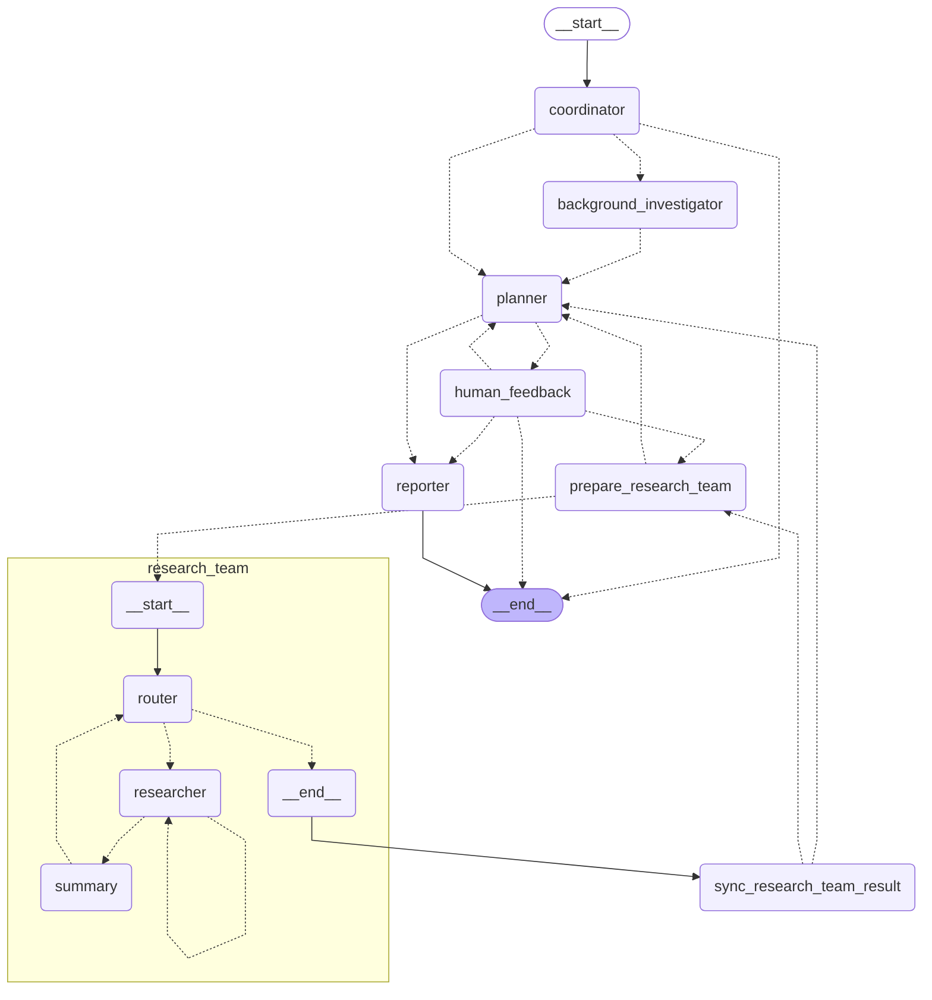

## 架构

DeerFlow 实现了一个模块化的多智能体系统架构，专为自动化研究和代码分析而设计。该系统基于 LangGraph 构建，实现了灵活的基于状态的工作流，其中组件通过定义良好的消息传递系统进行通信。

系统采用了精简的工作流程，包含以下组件：

1. **协调器 (Coordinator)**：管理工作流生命周期的入口点

   - 根据用户输入启动研究过程
   - 在适当时候将任务委派给规划器
   - 作为用户和系统之间的主要接口

2. **背景调查节点 (Background Investigation)**: 背景信息搜索 
   - 在规划前执行初步搜索，提供背景信息

3. **规划器(Planner)**：负责任务分解和规划的战略组件

   - 分析研究目标并创建结构化执行计划
   - 确定是否有足够的上下文或是否需要更多研究
   - 管理研究流程并决定何时生成最终报告
  
4. **人类反馈 (Human Feedback)**：Human-in-the-loop
   - 允许用户审查和修改研究计划
   - 支持多轮修改

5. **研究团队 (Research Team)**：执行计划的专业智能体集合：

   - **研究员 (Researcher)**：使用网络搜索引擎、爬虫甚至 MCP 服务等工具进行网络搜索和信息收集。
   - **编码员(Coder)**：使用 Python REPL 工具处理代码分析、执行和技术任务。
     每个智能体都可以访问针对其角色优化的特定工具，并在 LangGraph 框架内运行

6. **报告员 (Reporter)**：研究输出的最终阶段处理器
   - 汇总研究团队的发现
   - 处理和组织收集的信息
   - 生成全面的研究报告
  

